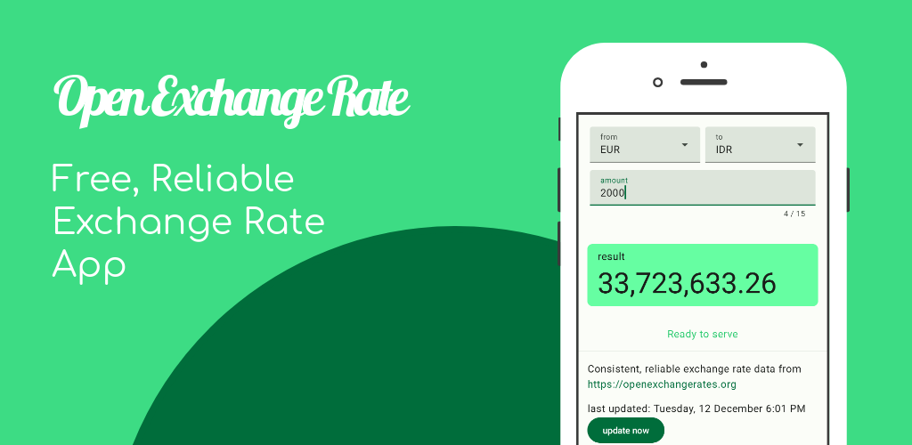

 

  

## About
Free and Reliable Exchange Rates App.
  

**Architecture—Clean Architecture, UDF (with [Kotlin Flow](https://developer.android.com/kotlin/flow), [Kotlin Coroutines](https://developer.android.com/kotlin/coroutines)), MVVM**

**Data & Domain layer**

- Network—[Ktor Client](https://ktor.io/docs/client-supported-platforms.html), [Kotlinx JSON Serialization](https://kotlinlang.org/docs/serialization.html)
- Local Storage—[Preference Data Store](https://developer.android.com/topic/libraries/architecture/datastore)

**Presentation layer**

- [Jetpack Compose](https://developer.android.com/jetpack/compose/why-adopt), [Material3](https://developer.android.com/jetpack/androidx/releases/compose-material3)
- [Jetpack ViewModel Compose](https://developer.android.com/jetpack/compose/libraries#viewmodel)
- [Jetpack Lifecycle](https://developer.android.com/jetpack/androidx/releases/lifecycle)

**Dependency Injection**—[Dagger Hilt](https://dagger.dev/hilt/) with [KSP](https://kotlinlang.org/docs/ksp-overview.html)

## Credits
This software uses the following:

- [Open Exchange Rates API](https://docs.openexchangerates.org/reference/api-introduction)
- [SVG Repo-App Icon](https://www.svgrepo.com/svg/301555/exchange-rate-rate)
- [Hotpot Creative Helper-Google Play Feature Graphics](https://hotpot.ai/templates/google-play-feature-graphic)
- [Excalidraw-Sketching Mockup](https://excalidraw.com/)

## Contact
Meyta Taliti - [@meytataliti](https://medium.com/@meytataliti) - meytajennis@gmail.com

(<a href="#readme-top">back to top</a>)

